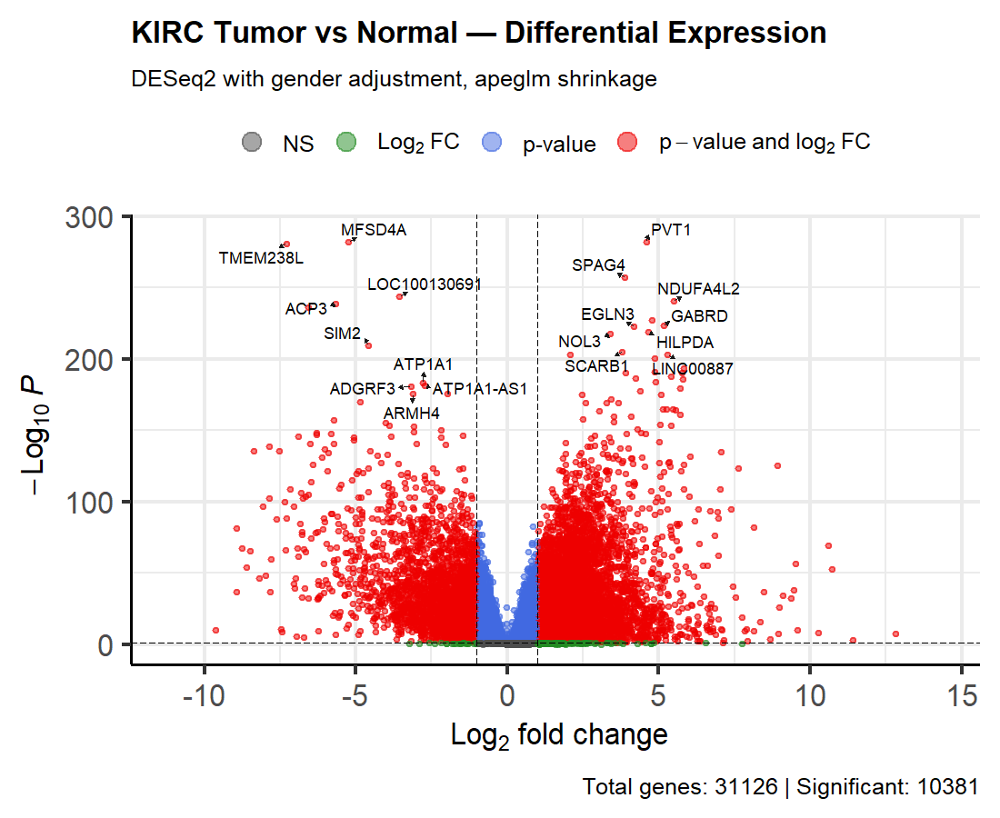
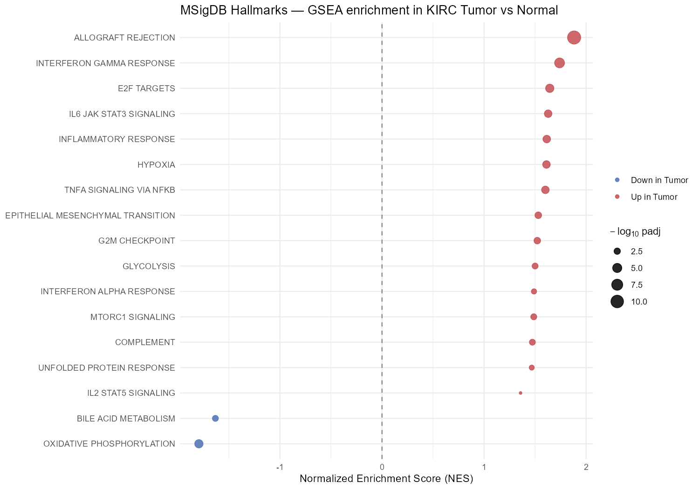
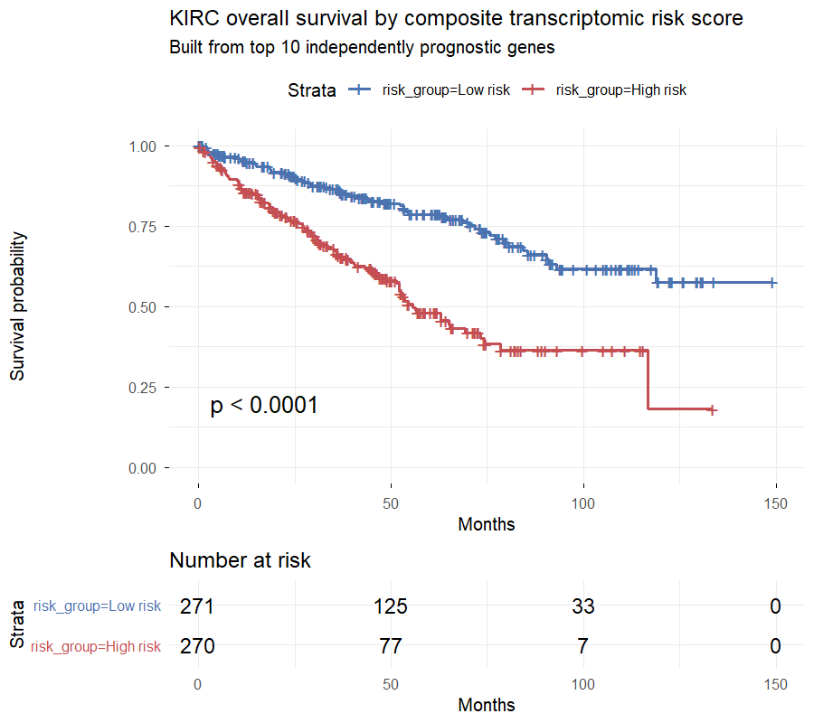

# KIRC RNA-seq Analysis: Differential Expression and Survival

> End-to-end transcriptomic analysis of clear cell renal cell carcinoma (TCGA-KIRC), from raw counts through a clinically meaningful prognostic risk score.

[](https://pri013.shinyapps.io/kirc-rnaseq-explorer/)
[](https://pri013.github.io/kirc-rnaseq-survival/reports/kirc_analysis_report.html)
[](https://www.r-project.org/)

## Quick links

🚀 **[Interactive dashboard](https://pri013.shinyapps.io/kirc-rnaseq-explorer/)** — search any gene, see its expression, KM curve, and statistics

📊 **[Full analysis report (HTML)](https://pri013.github.io/kirc-rnaseq-survival/reports/kirc_analysis_report.html)** — narrative writeup with methods, results, and discussion

💻 **[Source code](https://github.com/pri013/kirc-rnaseq-survival/tree/main/R)** — numbered R scripts (01 → 06)

---

## TL;DR

End-to-end transcriptomic analysis of **543 KIRC tumors** and **72 matched normal kidney samples** from The Cancer Genome Atlas, answering three connected questions:

| Question | Finding |
|---|---|
| What genes are dysregulated in tumors? | **10,381 significantly DE genes** (7,193 up, 3,188 down); top hits — CA9, NDUFA4L2, EGLN3, HILPDA — recapitulate canonical HIF/VHL biology |
| What pathways are affected? | Canonical KIRC signature confirmed: **HIF-driven hypoxia + Warburg metabolic shift + heavy immune infiltration**, validated across three independent methods (GSEA Hallmarks, KEGG, GO BP) |
| Which genes predict survival? | **20 genes independently prognostic** after multivariate adjustment for stage, grade, age, sex; composite 10-gene risk score: **HR = 2.72 (95% CI: 1.98–3.75, p < 0.0001)** |

---

## Research question

> Which genes and biological pathways are dysregulated in clear cell renal cell carcinoma compared to matched normal kidney, and which dysregulated genes independently predict patient overall survival after adjustment for clinical covariates?

This is the standard oncology biomarker-discovery flow: **differential expression → pathway interpretation → survival validation**. The analysis recapitulates validated KIRC biology and extends it with a transcriptomic risk score that captures prognostic information beyond standard clinical staging.

---

## Key figures

### Differential expression



10,381 significantly DE genes (padj < 0.05, |log2FC| > 1). Top upregulated hits include the canonical HIF transcriptional targets — **CA9, NDUFA4L2, EGLN3, HILPDA** — strongly validating the VHL-loss biology of clear cell RCC.

### Pathway enrichment



GSEA against MSigDB Hallmarks identified 17 significant pathways. Reading the figure: **immune infiltration** (allograft rejection, IFN-γ response) and **HIF/glycolysis** are activated; **oxidative phosphorylation** is depleted — the textbook Warburg metabolic shift driven by HIF stabilization.

### Survival analysis



A 10-gene composite risk score derived from the independently prognostic genes stratifies patients with **HR = 2.72 (95% CI: 1.98–3.75, p < 0.0001)** — a clinically meaningful effect size that captures information beyond standard clinical staging.

---

## Approach

1. **Data acquisition** — uniformly processed TCGA-KIRC counts via `recount3` (Monorail pipeline, STAR alignment to hg38/GENCODE v26)
2. **QC** — gene filtering, variance-stabilizing transformation, PCA confirms tumor/normal separation (PC1: 29% variance)
3. **Differential expression** — DESeq2 negative binomial GLM with gender adjustment; `apeglm` shrinkage for effect-size stability
4. **Pathway enrichment** — GSEA via `fgsea` against MSigDB Hallmarks + KEGG; ORA via `clusterProfiler` against GO Biological Process
5. **Survival modeling** — univariate and multivariate Cox proportional hazards models (adjusting for stage, grade, age, sex); Kaplan-Meier curves; signed composite risk score

---

## Tech stack

- **R 4.4** — managed with `renv` for pinned, reproducible package versions
- **Bioconductor:** DESeq2, recount3, fgsea, clusterProfiler, org.Hs.eg.db, EnhancedVolcano, ComplexHeatmap, survival, survminer
- **Tidyverse:** dplyr, ggplot2, tidyr, purrr
- **Reporting:** Quarto → HTML hosted on GitHub Pages
- **Dashboard:** R Shiny (bslib, plotly, DT) → hosted on shinyapps.io

---

## Repository structure
kirc-rnaseq-survival/
├── R/
│   ├── 01_load_data.R              # Pull TCGA-KIRC from recount3
│   ├── 02_explore_data.R           # Clinical metadata + EDA
│   ├── 03_qc_counts.R              # Filtering, VST, PCA
│   ├── 04_differential_expression.R    # DESeq2 + apeglm
│   ├── 05_pathway_enrichment.R     # GSEA + ORA
│   ├── 06_survival_analysis.R      # Cox regression + risk score
│   ├── prepare_shiny_data.R        # Bundle results for dashboard
│   └── shiny_app/
│       └── app.R                   # Interactive dashboard
├── reports/
│   └── kirc_analysis_report.qmd    # Full Quarto report
├── figures/                        # Generated figures
├── results/                        # DE results, Cox HRs, GSEA tables
├── data/                           # gitignored — regenerated by scripts
└── renv.lock                       # Pinned package versions

---

## Reproduction

```bash
# 1. Clone the repository
git clone https://github.com/pri013/kirc-rnaseq-survival.git
cd kirc-rnaseq-survival

# 2. Open the project in RStudio
#    (open kirc-rnaseq-survival.Rproj)

# 3. Restore the R environment (5–10 min)
#    In RStudio Console:
#    renv::restore()

# 4. Run scripts in numbered order
#    01_load_data.R downloads ~500 MB from recount3 on first run.
source("R/01_load_data.R")
source("R/02_explore_data.R")
source("R/03_qc_counts.R")
source("R/04_differential_expression.R")
source("R/05_pathway_enrichment.R")
source("R/06_survival_analysis.R")

# 5. Render the report
quarto::quarto_render("reports/kirc_analysis_report.qmd")

# 6. (Optional) Run the dashboard locally
source("R/prepare_shiny_data.R")
shiny::runApp("R/shiny_app")
```

Software environment, exact package versions, and data provenance are documented in `renv.lock` and the rendered report.

---

## Roadmap

- [x] Differential expression analysis
- [x] Pathway enrichment (GSEA + ORA)
- [x] Survival analysis + composite risk score
- [x] Quarto analysis report
- [x] Interactive Shiny dashboard
- [ ] Python replication (PyDESeq2 + lifelines)
- [ ] Containerized Nextflow pipeline (FASTQ → counts)
- [ ] External validation in independent KIRC cohort

---

## Author

**Priya Dhumal**

[GitHub](https://github.com/pri013) · [LinkedIn](https://www.linkedin.com/in/priya13d/) .

---

## License

MIT — see LICENSE for details.